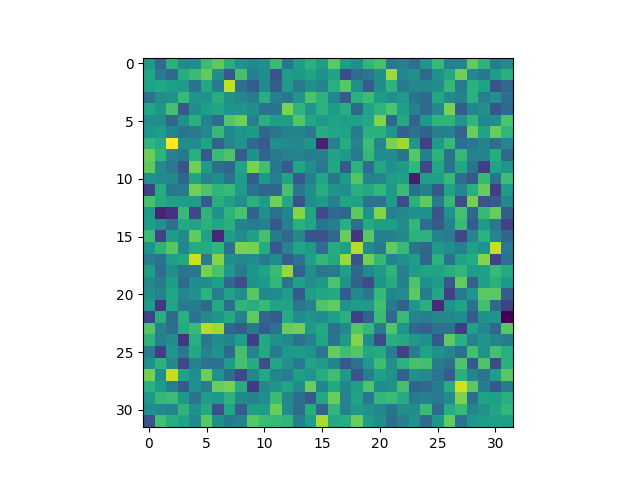
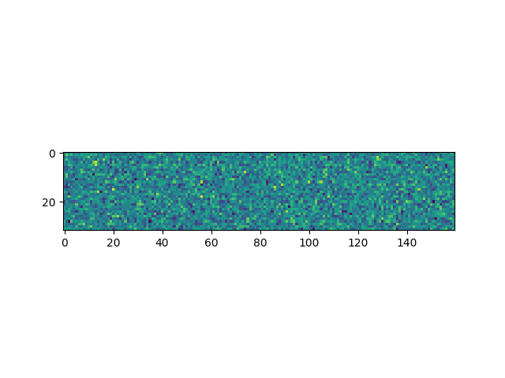
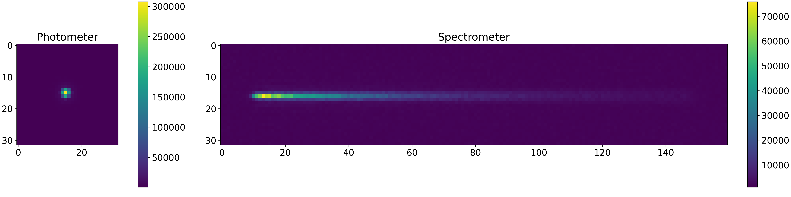
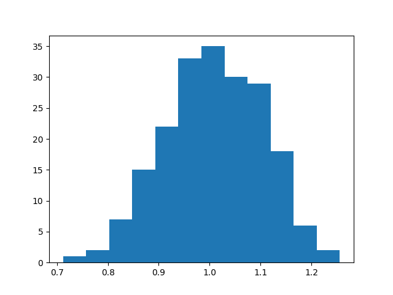
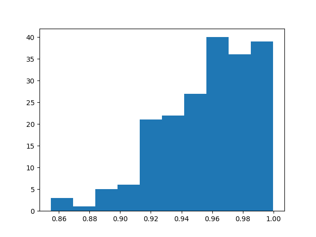

.. _quantum_efficiency_map:

================================
Quantum efficiency variation map
================================

The :class:`~exosim.tools.quantumEfficiencyMap.QuantumEfficiencyMap` tool creates
quantum-efficiency (QE) variation maps for use in `ExoSim` (see :ref:`qe_map`).

The tool assumes that the pixel QE is normally distributed around the median
value, which comes from the :ref:`responsivity`, and it needs the standard
deviation of that distribution as input. It then randomises the QE of each pixel
accordingly.

Set the standard deviation in the tool input parameters:

.. code-block:: xml

    <channel> channel_name
        <detector>
            <qe_sigma> 0.1 </qe_sigma>
        </detector>
    </channel>

Then run the tool:

.. code-block:: python

    import exosim.tools as tools

    tools.QuantumEfficiencyMap(options_file='tools_input_example.xml',
                               output='output_qe_map.h5')

The result looks like this:

and once applied:

with the QE normalisation distributed as:

The tool can also model QE degradation over time. Given the amplitude of the
degradation and its time scale, it draws a randomised ageing factor for each
pixel and interpolates the QE map in time so that the detector ages accordingly:

.. code-block:: xml

    <channel> channel_name
        <detector>
            <qe_sigma> 0.1 </qe_sigma>
            <qe_aging_factor> 0.01 </qe_aging_factor>
            <qe_aging_time_scale unit="hr"> 5 </qe_aging_time_scale>
        </detector>
    </channel>

The QE at 5 hr is then the product of the map computed with
``<qe_sigma> 0.1 </qe_sigma>`` and the aged map.
