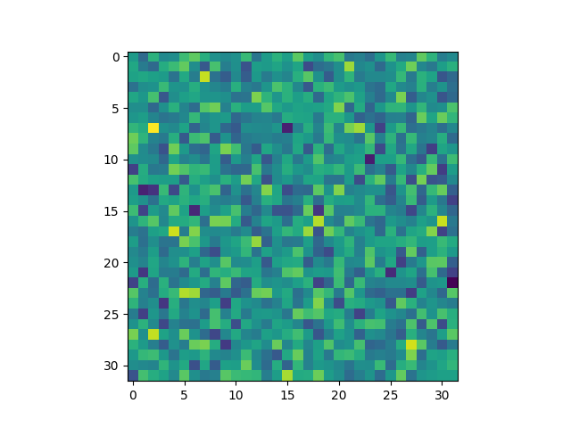

.. _quantum_efficiency_map:

===================================
Quantum efficiency variation map
===================================

The :class:`~exosim.tools.quantumEfficiencyMap.QuantumEfficiencyMap` tool
allows the creation of quantum efficiency variation maps that can be used in `ExoSim`(see :ref:`qe_map`).

The tool assumes that the QE has a normal distribution around the median (which is given by the :ref:`responsivity`) and it requires the standard deviation as input.
Then it randomises the pixel QE according to the indicated distribution.

The following configuration are to be set into the tool input parameters

.. code-block:: xml

    <channel> channel_name
        <detector>
            <qe_sigma> 0.1 </qe_sigma>
        </detector>
    </channel>

Then the tool can be run as

.. code-block:: python

    import exosim.tools as tools

    tools.QuantumEfficiencyMap(options_file='tools_input_example.xml',
                               output='output_qe_map.h5')

The result will be like

and then applied as

with the QE normalisation distributed as

The default :class:`~exosim.tools.quantumEfficiencyMap.QuantumEfficiencyMap`
also allow for QE degradation. Given the the amplitude of the degradation an the time scale,
it creates a randomised aging factor for each pixel and interpolate the QE efficiency map in time to
age accordingly.

.. code-block:: xml

    <channel> channel_name
        <detector>
            <qe_sigma> 0.1 </qe_sigma>
            <qe_aging_factor> 0.01 </qe_aging_factor>
            <qe_aging_time_scale unit="hr"> 5 </qe_aging_time_scale>
        </detector>
    </channel>

The resulting QE at 5 hr will be the product between the QE map computed with :code:`<qe_sigma> 0.1 </qe_sigma>`
and the aged map.
