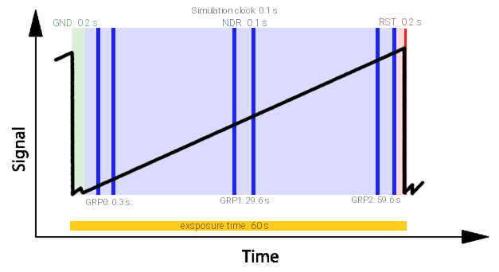
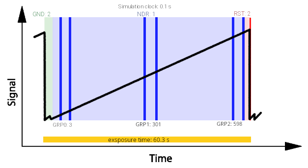

.. _readout_scheme_calculator:

=========================
Readout scheme calculator
=========================

Suppose we want to produce the readout scheme below, but we only know a few
things about it.

The ramp is sampled at the ``readout_frequency`` cadence defined in
:ref:`sub-exposures creation`. In this example we want to spend :math:`0.2 \, s`
in the ground (GND) state and :math:`0.2 \, s` before the reset (RST) state. The
NDRs are read at a constant cadence of :math:`0.1 \, s`. We then want 3 groups
that split the rest of the ramp into equal parts, each group made of 2 NDRs
separated by the time needed to read one NDR.

To build the scheme we need the time spent between groups, which the figure gives
along the bottom as a time from the start of the simulation. We also need to
convert these human-readable units into the simulation-clock units that
:class:`~exosim.tasks.subexposures.compute_reading_scheme.ComputeReadingScheme`
expects (see :ref:`reading_scheme`). Finally, we want to use the ramp sampling
well, so we do not want to saturate the detector.
:class:`~exosim.tools.readoutSchemeCalculator.ReadoutSchemeCalculator` handles all
of this.

First, translate the known parameters into the channel section of the tool input
file:

.. code-block:: xml

    <channel> channel name
        <readout>
            <n_NRDs_per_group> 2 </n_NRDs_per_group>
            <n_groups>  3 </n_groups>
            <readout_frequency unit ='s'> 0.1 </readout_frequency>
            <Ground_time unit ='s'> 0.2 </Ground_time>
            <Reset_time unit ='s'> 0.2 </Reset_time>
        </readout>
    </channel>

The ``readout_frequency`` can also be given in :math:`Hz` instead of :math:`s`.

To estimate the saturation time the tool also needs the focal planes. Here we
assume they are stored in ``input_file.h5``:

.. code-block:: python

    import exosim.tools as tools

    tools.ReadoutSchemeCalculator(options_file='tools_input_example.xml',
                                  input_file='input_file.h5')

The tool then prints the inputs to write in the payload configuration file. For
this figure, the result is:

.. code-block:: xml

    <channel> channel name
        <readout>
            <readout_frequency unit="Hz">10</readout_frequency>
            <n_NRDs_per_group> 2 </n_NRDs_per_group>
            <n_groups> 3 </n_groups>
            <n_sim_clocks_Ground> 2 </n_sim_clocks_Ground>
            <n_sim_clocks_first_NDR> 1 </n_sim_clocks_first_NDR>
            <n_sim_clocks_Reset> 2 </n_sim_clocks_Reset>
            <n_sim_clocks_groups> 296 </n_sim_clocks_groups>
        </readout>
    </channel>

which gives the following scheme:

You can also set a custom exposure time to use instead of the saturation time:

.. code-block:: xml

    <channel> channel name
        <readout>
            <exposure_time unit="s"> 60.3 </exposure_time>
        </readout>
    </channel>
